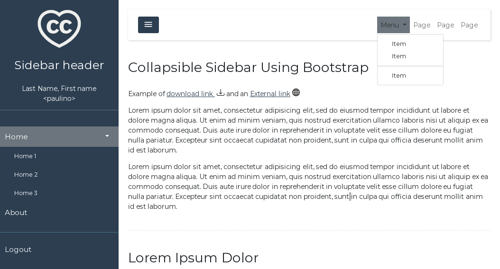

# Collapsible Sidebar Using Bootstrap for DJango

*Collapsible Sidebar Using Bootstrap* is a base template with a bootstrap simple
customization in self-hosted mode (non-CDN).

Features:

- Bootstrap 5.1
- Django 4
- Templates included:
  - bootstrap_base.html
  - registration/login.html
  - snippets/show_err.html
  - snippets/show_messages.html  
- Bootstrap customization available at bootstrap-theme directory.
- Custom font from google-fonts in local static files.

Bootstrap theme and fonts are customizable using scripts included. See details
bellow.

## Preview




## Installation

The preferred way to install is via pip

    pip3 install django-bootstrap-sidebar

but you can install in develop mode cloning this repo but static files are not
included in the repo. See *Customize bootstrap theme section* for details.

After the installation in `settings.py` of your Django instance 
add `bootstrapsidebar`:

```python
INSTALLED_APPS = [
    ...
    'bootstrapsidebar'
    ...
]
```

## Testing example base-templates

To test the sidebar and login pages add to `urls.py`:

```python

from django.views.generic import TemplateView
from django.contrib.auth import views as auth_views

urlpatterns = [
    ...
    path('demo',TemplateView.as_view(template_name="bootstrap_base.html"),name='demo'),
    path('login',auth_views.LoginView.as_view(), name="login"),
```

Pages can be tested at http://localhost:8000/demo and http://localhost:8000/login

## Blocks available at page layout

The base template (`bootstrap_base.html`) includes the following hierarchical
blocks:

- *block custom-css*
- *block head*
- *block page-wrapper*: to override full page, included sidebar.
  - *block sidebar*
  - *block navbar*: to override top navbar
    - *navbar-links*: only to add links in default template navbar.
  - *block messages*: by default this block uses `snippets/show_messages.html`
  - *block content*
  - *block footer*

The `registration/login.html` is an example page using base-template without
sidebar.

## Customize bootstrap theme

Install the package in dev mode is recommended if you want to customize the
Bootstrap Theme. First clone this repo and install in dev mode:

    pip install -e ./django-bootstrap-sidebar

Bootstrap static files and fonts are not included in the repo. They are
generated/downloaded with the commands of makefile but the *node* environment
and `npm` are required.

Bootstrap can be customized at file `bootstrap-theme/custom.scss`. An easy way
to create a new customization is some online theme builder
like <https://bootstrap.build/> and download the *custom.scss*.

To generate/upgrade static files makefile automates the process, run make:

    make

## License

The project is licensed under the Apache 2.0 license.

## Author

Developed and maintained by Paulino Ruiz de Clavijo Vázquez